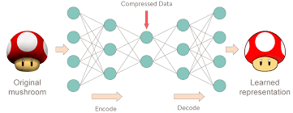
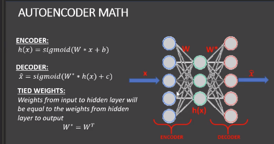
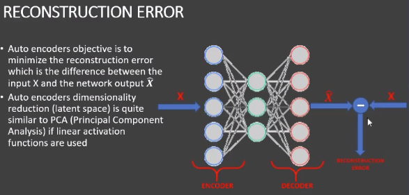

# Image Denoising 
## Using AutoEncoders in Keras and Python

#### Overview
- We use autoencoders to perform image denoising
- Autoencoders are a type of artificial neural networks that are used to 
perform a task of data encoding (representation learning).
- We will feed in noisy images from the fashion dataset as input.
- The output is a clean (denoised) image.

#### Class transition
- 0 = T-shirt
- 1 = Trouser
- 2 = Pullover
- 3 = Dress
- 4 = Coat
- 5 = Sandal
- 6 = shirt
- 7 = Sneaker
- 8 = Bag
- 9 = Ankle boot

### AutoEncoders Intuition
Auto encoders use the same input data for the input and output. 

### The Code Layer
- Auto encoders work by adding a bottleneck in the network
- This bottleneck forces the network to create a compressed(encoded) version of
the original input
- Auto encoders work well if correlations exists between input data (performs poorly
if the all input data is independent)
- Great Reference: "Intro to Auto encoders by Jeremy Jordan"

